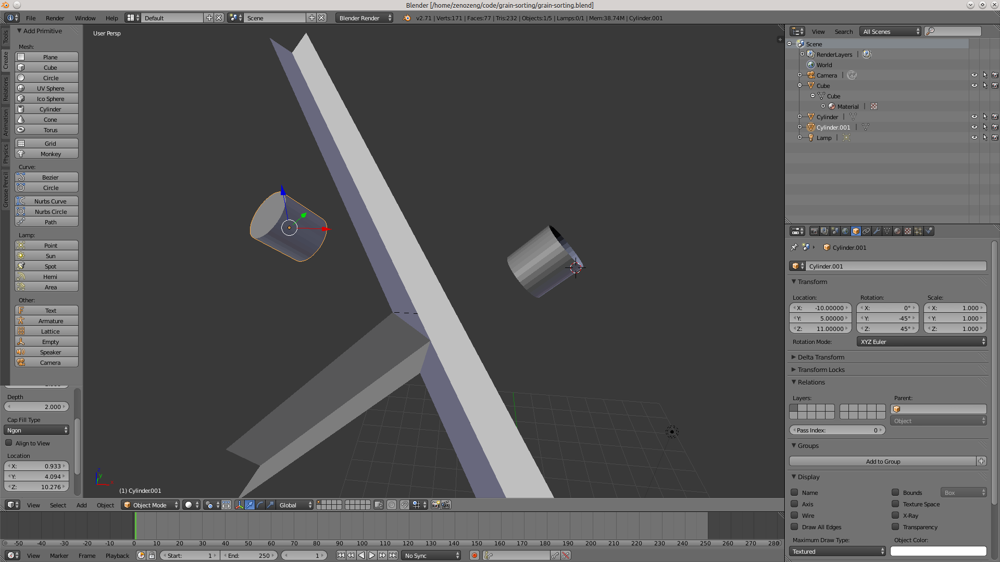
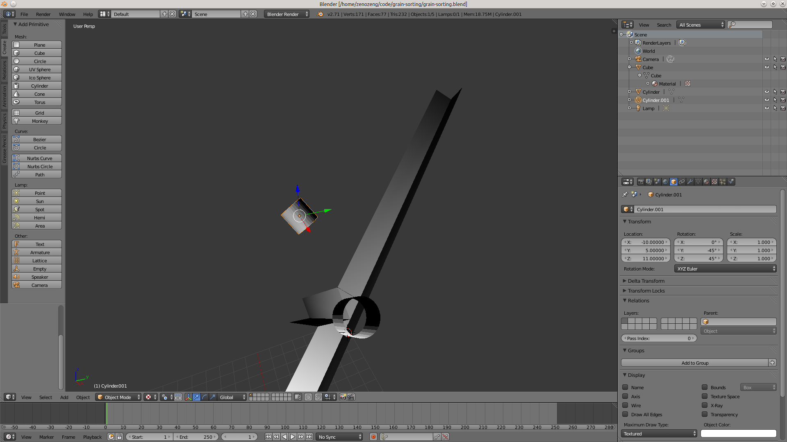
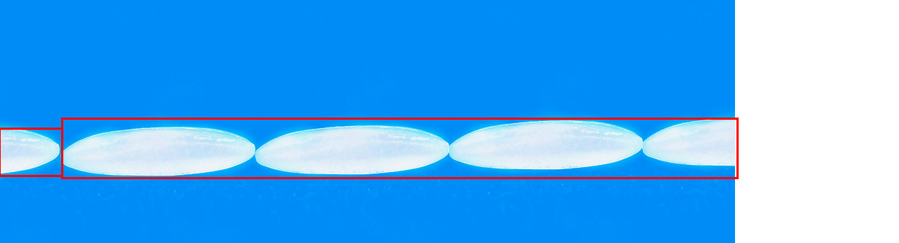
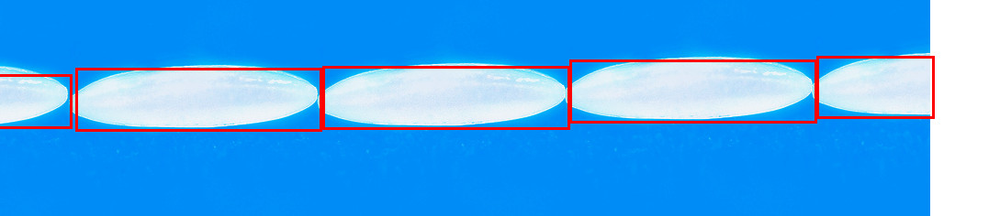
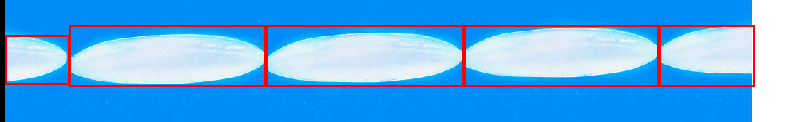
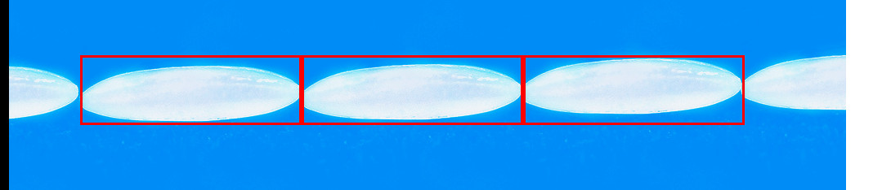
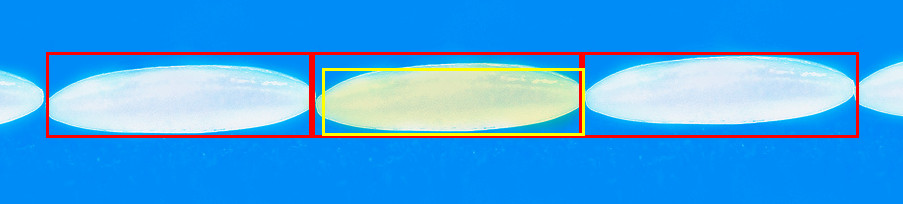
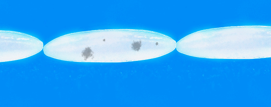
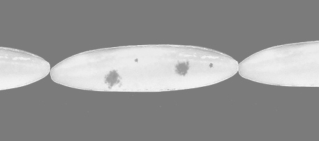

# rice-sorting

Rice sorting based on machine vision.

这是一个概念验证的 repo，不是具体实现哦。
为了方便演示，
我们这里用 tracking.js 这个库来操作，
实际的话，
可以考虑用 opencv 来替代掉以换取更高性能。

## 简介



如图所示，大米从上方滑入。
轨道被摆成一个适宜的角度，
使得绝大多数大米的阻力和重力分力抵消。



左侧有个高速摄像头，
连接一个树莓派或者服务器。
利用机器视觉进行判定。

```coffeescript
if 当前大米 is 劣质大米
    启动右侧气枪
    将大米喷入劣品分级轨道
else
    沿着当前轨道继续前进到下一环节。
```

## 机器视觉

### 背景的选取

检测区背景采用纯蓝色。

如果用黑色或背景的话，
那么大米边缘的坏点容易被忽略。
而黄色可能是发霉的大米之类。
蓝色是一个相对安全的颜色，
同时很容易和大米进行区分。

### 大米定位

这里我们简单的地使用 r, g, b 均大于 120 作为大米识别的标志。
扫一遍图片，
然后可以得到一些基本的矩形区域。

```javascript
tracking.ColorTracker.registerColor('rice', function(r, g, b) {
    var brightness = 120; 
    if (r > brightness && g > brightness && b > brightness) {
        return true;
    }
    return false;
});

var tracker = new tracking.ColorTracker(['rice']);
```



问题很明显，我们不能正确的分离大米，
如果调大亮度控制的话，
则会引入大米区域选择不全以及大米临界判断错误的问题。



所以我们拿到下面图这个之后再去寻找两个大米之间的交接处去切断。
直接找蓝色占比的极值点就好。


```javascript
// Rice Tracker on blue background
// Based on ColorTracker

var RiceTracker = function() {
    RiceTracker.prototype.track = function(pixels, width, height) {

        var self = this;

        // 基于颜色的基本定位
        tracking.ColorTracker.registerColor('rice', function(r, g, b) {
            var brightness = 120;
            if (r > brightness && g > brightness && b > brightness) {
                return true;
            }
            return false;
        });

        // Detect if it's blue background
        var isBackground = function(r, g, b) {
            return (b > r) && (b > g) && (r < 180) && (g < 180);
        };

        // 基于非背景色判定的横向切割
        var cut = function(rects) {

            var results = [];
            rects.forEach(function(rect) {
                // 计算每一列背景所占比例
                var rates = [];
                for(var i = rect.x; i < rect.width + rect.x; i++) {
                    var count = 0;
                    for(var j = rect.y; j < rect.height + rect.y; j++) {
                        var n = (j * width + i) * 4,
                            r = pixels[n],
                            g = pixels[n+1],
                            b = pixels[n+2];
                        if(isBackground(r, g, b)) {
                            count++;
                        }
                    }
                    var rate = count / rect.height;
                    rates.push(rate);
                }
                // 以极大值作为切割点，切割矩形
                // TODO: 如果背景占比波动厉害，可以用模拟退火优化这里
                var mark = 0;
                for(var i = 1; i < rates.length; i++) {
                    if((i == (rates.length - 1)) || // 这是最后一项了
                       ((rates[i] > 0.7) && // 背景占比要大于 70%
                        (i > mark + 20) && // 长度要大于 20px，用于简单地降低波动造成的影响
                        ((rates[i] >= rates[i - 1]) && (rates[i] >= rates[i + 1]))))
                    {
                        results.push({
                            x: mark + rect.x,
                            y: rect.y,
                            width: i - mark,
                            height: rect.height
                        });
                        mark = i;
                    }
                }
            });
            return results;
        };

        var tracker = new tracking.ColorTracker(['rice']);
        tracker.on('track', function(event) {
            var rects = event.data;
            rects = cut(rects);
            self.emit('track', {data: rects});
        });
        tracker.track(pixels, width, height);
    };
};

tracking.inherits(RiceTracker, tracking.Tracker);
```



过滤半颗大米的情况

```javascript
var filter = function(rects) {
    return rects.filter(function(rect) {
        console.log(rect);
        return rect.rateStart > 0.7 && rect.rateEnd > 0.7;
    });
};
```



### 大米质量判定

#### 偏黄大米识别

```javascript
(function() {
    tracking.ColorTracker.registerColor('yellow-rice', function(r, g, b) {
        var brightness = 120;
        if (!(r > brightness && g > brightness && b > brightness)) {
            return false; // isn't rice!
        }
        if(r > b && g > b) {
            // FIXME: 这里的判定有点简单了
            //        不过可以暂时作为 workround, 具体需要查一下相关公式
            return true; // 色彩偏黄
        }
        return false;
    });
    var tracker = new tracking.ColorTracker(['yellow-rice']);
    tracker.on('track', function(event) {
        event.data.forEach(function(rect) {
            plot(rect.x, rect.y, rect.width, rect.height, 'yellow');
        });
    });
    tracking.track('#img', tracker);
})();
```



#### 黑点识别





## 拓展

### 特判

这里有很多东西可能是一些特判，
实际使用的时候，
会有很多问题，
还是需要拿数据训练一下。

### 更多的分级

只要机器识别好，
然后在下面多增加几条轨道，
由于运动的速度是（基本）匀速所以可以，
事先mark好，
到了指定位置再吹入。

### 更快的速度

可以考虑并行多条轨道，
然后一个摄像头同时拍摄多轨，
然后分割后交给计算机处理。

## Pics

Remix based on IRRI's 1!_8500, which is licensed under cc-by-nc-sa 2.0.

See also: https://www.flickr.com/photos/ricephotos/382219911/in/photostream/

## Ref

- [A modern approach for Computer Vision on the web](http://trackingjs.com/)

- [Flood fill](http://zh.wikipedia.org/wiki/Flood_fill)
